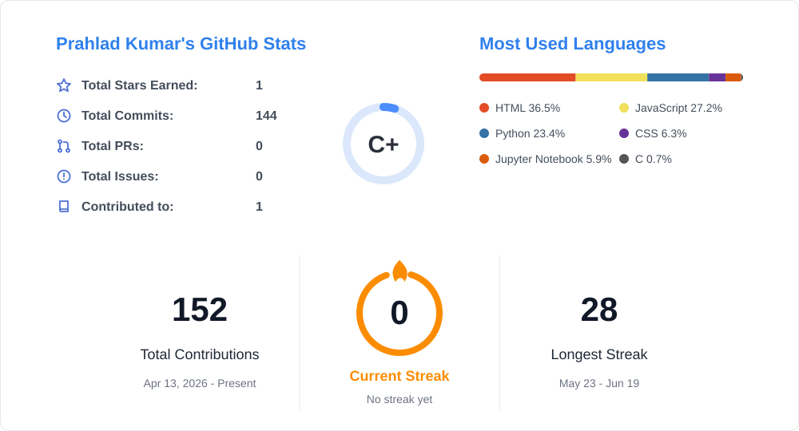

<!-- ============ HEADER BANNER ============ -->

  

<h1 align="center">Hi there, I'm <a href="https://github.com/prahladembedx">Prahlad</a> 👋</h1>

<h3 align="center">Developer • Data Analytics &amp; ML • Web Development</h3>

 

<!-- ============ CONTACT BADGES ============ -->

  
  
  
  

---

<!-- ============ ABOUT ============ -->
> [!NOTE]
> 🚀 I'm a developer interested in **data analytics**, **machine learning**, and **web development**.
>
> I enjoy building projects that combine data, intelligent systems, and practical user interfaces — from analyzing real-world datasets to turning the results into interactive applications.
>

## 🛠️ Tech Stack & Tooling

  

**Data & ML**

  
  
  
  
  
  
  

## 🚀 Featured Project

> [!TIP]
> ### 🌍 [AI-Powered Global Urban Heat Island Analysis and Prediction](https://github.com/prahladembedx/urban-heat-analysis)
> Analyzes how urban design and environmental factors influence heat intensity across **50 global cities (2015–2025)** and predicts land-surface temperature anomalies.
>
> - 📈 Best model: **Random Forest** (R² 0.705, MAE 0.218 °C)
> - 🔍 SHAP explainability, statistical testing, 15+ EDA charts
> - 🖥️ Interactive **Streamlit dashboard** with live ML predictions
>
> **Stack:** Python · Pandas · scikit-learn · XGBoost · SHAP · Plotly · Streamlit

## 📂 More Projects

| Project | What it does | Tech |
| :-- | :-- | :-- |
| [⌨️ SwiftKeys](https://github.com/prahladembedx/SwiftKeys) | Sleek, responsive typing speed test application | HTML · CSS · JavaScript |
| [🌦️ SkyCast React](https://github.com/prahladembedx/skycast-react) | Advanced weather app with forecast | React · JavaScript |
| [💰 Expense Tracker](https://github.com/prahladembedx/Expense-Tracker) | Record transactions, visualize spending, set budgets | JavaScript |
| [🏧 ATM Simulator](https://github.com/prahladembedx/ATM-Simulator-C) | ATM simulation program | C |
| [⏱️ CHRONO Ultra](https://github.com/prahladembedx/CHRONO-Ultra) | Web project built with HTML | HTML · CSS · JavaScript |

## 📊 GitHub Activity & Metrics

  

## 📫 Let's Connect

Open to conversations about data, web development, and climate tech. Reach out on [LinkedIn](https://www.linkedin.com/in/prahladembedx)!

<!-- ============ FOOTER ============ -->

  

